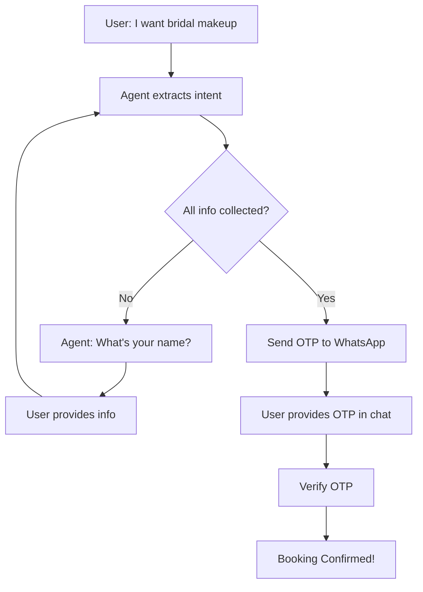

# 🎨 JinniChirag Makeup Artist - Backend API

A comprehensive, modular FastAPI backend with AI-powered chatbot, intelligent booking agent, and complete admin management system.

---

## 📁 Project Structure

```
chirag-sharma-backend/
│
├── app.py                       # ⚡ Main FastAPI application
├── config.py                    # ⚙️ Configuration & environment variables
├── database.py                  # 🗄️ MongoDB connection & collections
├── models.py                    # 📋 Pydantic request/response models
├── security.py                  # 🔐 JWT authentication & password hashing
├── services.py                  # 📡 External services (Twilio, Email, AI)
├── utils.py                     # 🛠️ Utility functions
├── prompts.py                   # 🤖 AI system prompts
│
├── routes_public.py             # 🌐 Public endpoints (no auth)
├── routes_agent.py              # 🤖 Agentic booking chatbot (NEW!)
├── agent_models.py              # 🧠 Agent state models (NEW!)
├── agent_service.py             # 🎯 Agent AI logic (NEW!)
├── memory_store.py              # 💾 Conversation memory (NEW!)
│
├── routes_admin_auth.py         # 🔑 Admin authentication
├── routes_admin_bookings.py     # 📅 Booking management
├── routes_admin_knowledge.py    # 📚 Knowledge base CRUD
├── routes_admin_analytics.py    # 📊 Analytics & statistics
│
├── requirements.txt             # 📦 Python dependencies
├── .env                         # 🔒 Environment secrets (create this)
└── README.md                    # 📖 This file
```

---

## 🚀 Quick Start

### 1️⃣ Install Dependencies
```bash
pip install -r requirements.txt
```

### 2️⃣ Configure Environment
Create `.env` file:
```env
# AI & Database
GROQ_API_KEY=your_groq_api_key_here
MONGO_URI=mongodb://localhost:27017

# Authentication
JWT_SECRET=your_super_secret_jwt_key_change_this

# Twilio WhatsApp
TWILIO_ACCOUNT_SID=your_twilio_account_sid
TWILIO_AUTH_TOKEN=your_twilio_auth_token
TWILIO_WHATSAPP_FROM=whatsapp:+14155238886

# Email (Brevo for production, SMTP for local)
BREVO_API_KEY=your_brevo_api_key
SMTP_EMAIL=your_email@gmail.com
SMTP_PASSWORD=your_app_specific_password

# Frontend
FRONTEND_URL=https://yourdomain.com
```

### 3️⃣ Run Server
```bash
# Method 1: Direct Python
python app.py

# Method 2: Uvicorn with auto-reload
uvicorn app:app --reload --port 8000

# Method 3: Production
uvicorn app:app --host 0.0.0.0 --port 8000 --workers 4
```

### 4️⃣ Test API
```bash
curl http://localhost:8000/health
```

---

## 📚 Complete API Reference

### 🌐 Public Endpoints (No Authentication)

#### Health Check
```http
GET /health
```
**Response:**
```json
{
  "status": "ok",
  "timestamp": "2024-01-21T10:30:00.000Z"
}
```

#### Simple Q&A Chatbot
```http
POST /chat
Content-Type: application/json

{
  "messages": [
    {"role": "user", "content": "What services do you offer?"}
  ],
  "language": "en"
}
```
**Response:**
```json
{
  "reply": "We offer Bridal Makeup, Party Makeup, Engagement Makeup..."
}
```

**Languages:** `en` (English), `ne` (Nepali), `hi` (Hindi), `mr` (Marathi)

#### Form-Based Booking Flow

**Step 1: Request OTP**
```http
POST /bookings/request
Content-Type: application/json

{
  "service": "Bridal Makeup",
  "package": "Premium",
  "name": "Priya Sharma",
  "email": "priya@example.com",
  "phone": "+977-9876543210",
  "phone_country": "Nepal",
  "service_country": "Nepal",
  "address": "Thamel, Kathmandu",
  "pincode": "44600",
  "date": "2024-12-25",
  "message": "Wedding day makeup"
}
```
**Response:**
```json
{
  "booking_id": "xyz789abc",
  "message": "OTP sent via WhatsApp"
}
```

**Step 2: Verify OTP**
```http
POST /bookings/verify-otp
Content-Type: application/json

{
  "booking_id": "xyz789abc",
  "otp": "123456"
}
```
**Response:**
```json
{
  "message": "Booking confirmed",
  "booking_id": "507f1f77bcf86cd799439011"
}
```

---

### 🤖 Agentic Chatbot (Conversational Booking)

#### How It Works



#### Conversation Flow

**Stage 1: Initial Contact**
```http
POST /agent/chat
Content-Type: application/json

{
  "message": "Hi, I need bridal makeup",
  "language": "en"
}
```
**Response:**
```json
{
  "reply": "Wonderful! Bridal makeup is our specialty. What's your name?",
  "session_id": "abc123xyz",
  "stage": "collecting_info",
  "action": "continue",
  "missing_fields": ["name", "email", "phone", "address", "date", ...],
  "booking_id": null
}
```

**Stage 2: Continue Conversation**
```http
POST /agent/chat
Content-Type: application/json

{
  "message": "My name is Priya Sharma",
  "session_id": "abc123xyz",
  "language": "en"
}
```
**Response:**
```json
{
  "reply": "Nice to meet you, Priya! What's your email address?",
  "session_id": "abc123xyz",
  "stage": "collecting_info",
  "action": "continue",
  "missing_fields": ["email", "phone", "address", "date", ...],
  "booking_id": null
}
```

**Stage 3: All Info Collected → OTP Sent**
```json
{
  "reply": "Perfect! I've sent a 6-digit OTP to your WhatsApp. Please share it here.",
  "session_id": "abc123xyz",
  "stage": "otp_sent",
  "action": "send_otp",
  "missing_fields": [],
  "booking_id": "xyz789"
}
```

**Stage 4: OTP Verification**
```http
POST /agent/chat
Content-Type: application/json

{
  "message": "123456",
  "session_id": "abc123xyz",
  "language": "en"
}
```
**Response:**
```json
{
  "reply": "🎉 Congratulations Priya! Your booking is confirmed!",
  "session_id": "abc123xyz",
  "stage": "confirmed",
  "action": "booking_confirmed",
  "missing_fields": [],
  "booking_id": "xyz789"
}
```

#### Agent Features

✅ **Intent Extraction** - Automatically extracts booking details from natural conversation
✅ **Memory Management** - Remembers entire conversation context
✅ **Multi-turn Conversation** - Handles back-and-forth naturally
✅ **Smart Field Collection** - Asks for ONE thing at a time
✅ **Flexible Input** - User can provide info in any order
✅ **Auto OTP** - Sends OTP when all details collected
✅ **In-Chat Verification** - No need to switch to separate OTP form
✅ **Multi-language** - Works in 4 languages

---

### 🔑 Admin Authentication

#### Login
```http
POST /admin/login
Content-Type: application/json

{
  "email": "admin@example.com",
  "password": "securepassword123"
}
```
**Response:**
```json
{
  "access_token": "eyJhbGciOiJIUzI1NiIsInR5cCI6IkpXVCJ9...",
  "token_type": "bearer",
  "email": "admin@example.com",
  "role": "admin"
}
```

#### Forgot Password
```http
POST /admin/forgot-password
Content-Type: application/json

{
  "email": "admin@example.com"
}
```
**Response:**
```json
{
  "message": "If your email is registered, you will receive a password reset link"
}
```

#### Reset Password
```http
POST /admin/reset-password
Content-Type: application/json

{
  "token": "reset_token_from_email",
  "new_password": "newSecurePass123"
}
```
**Response:**
```json
{
  "message": "Password reset successful"
}
```

#### Verify Token
```http
GET /admin/verify-token
Authorization: Bearer <your_jwt_token>
```
**Response:**
```json
{
  "valid": true,
  "email": "admin@example.com",
  "role": "admin"
}
```

---

### 📅 Admin Booking Management

**All endpoints require:** `Authorization: Bearer <jwt_token>`

#### List All Bookings
```http
GET /admin/bookings?status=pending&limit=50&skip=0
Authorization: Bearer <jwt_token>
```
**Response:**
```json
{
  "bookings": [
    {
      "_id": "507f1f77bcf86cd799439011",
      "service": "Bridal Makeup",
      "package": "Premium",
      "name": "Priya Sharma",
      "email": "priya@example.com",
      "phone": "+977-9876543210",
      "status": "pending",
      "created_at": "2024-01-21T10:30:00Z"
    }
  ],
  "total": 15,
  "limit": 50,
  "skip": 0
}
```

#### Search Bookings
```http
POST /admin/bookings/search
Authorization: Bearer <jwt_token>
Content-Type: application/json

{
  "search": "Priya",
  "status": "pending",
  "date_from": "2024-01-01",
  "date_to": "2024-12-31",
  "limit": 50,
  "skip": 0
}
```

#### Get Booking Details
```http
GET /admin/bookings/507f1f77bcf86cd799439011
Authorization: Bearer <jwt_token>
```

#### Update Booking Status
```http
PATCH /admin/bookings/507f1f77bcf86cd799439011/status
Authorization: Bearer <jwt_token>
Content-Type: application/json

{
  "status": "approved"
}
```

**Status Options:** `pending`, `approved`, `completed`, `cancelled`

**WhatsApp Notifications:**
- `approved` → Confirmation message sent
- `cancelled` → Apology message sent
- `completed` → Thank you message sent

#### Delete Booking
```http
DELETE /admin/bookings/507f1f77bcf86cd799439011
Authorization: Bearer <jwt_token>
```

---

### 📚 Admin Knowledge Base

**All endpoints require:** `Authorization: Bearer <jwt_token>`

#### Create Knowledge Entry
```http
POST /admin/knowledge
Authorization: Bearer <jwt_token>
Content-Type: application/json

{
  "title": "Bridal Makeup Packages",
  "content": "We offer 3 packages: Basic (₹10k), Premium (₹20k), Deluxe (₹30k)...",
  "language": "en",
  "is_active": true
}
```

#### List Knowledge Entries
```http
GET /admin/knowledge?language=en&is_active=true
Authorization: Bearer <jwt_token>
```

#### Get Single Entry
```http
GET /admin/knowledge/507f1f77bcf86cd799439011
Authorization: Bearer <jwt_token>
```

#### Update Entry
```http
PATCH /admin/knowledge/507f1f77bcf86cd799439011
Authorization: Bearer <jwt_token>
Content-Type: application/json

{
  "content": "Updated package information...",
  "is_active": true
}
```

#### Delete Entry
```http
DELETE /admin/knowledge/507f1f77bcf86cd799439011
Authorization: Bearer <jwt_token>
```

---

### 📊 Admin Analytics

**All endpoints require:** `Authorization: Bearer <jwt_token>`

#### Overview Statistics
```http
GET /admin/analytics/overview
Authorization: Bearer <jwt_token>
```
**Response:**
```json
{
  "total_bookings": 150,
  "pending_bookings": 12,
  "approved_bookings": 45,
  "completed_bookings": 85,
  "cancelled_bookings": 8,
  "recent_bookings_7_days": 23,
  "today_bookings": 5
}
```

#### Bookings by Service
```http
GET /admin/analytics/by-service
Authorization: Bearer <jwt_token>
```
**Response:**
```json
{
  "services": [
    {"service": "Bridal Makeup", "count": 85},
    {"service": "Party Makeup", "count": 42},
    {"service": "Engagement Makeup", "count": 23}
  ]
}
```

#### Monthly Trends
```http
GET /admin/analytics/by-month
Authorization: Bearer <jwt_token>
```
**Response:**
```json
{
  "monthly_data": [
    {"year": 2024, "month": 1, "count": 15},
    {"year": 2023, "month": 12, "count": 22}
  ]
}
```

---

## 🧠 How the Agentic Chatbot Works

### Architecture Overview

```
┌─────────────────────────────────────────────────────────────┐
│                     USER MESSAGE                             │
│              "I want bridal makeup for Dec 25"               │
└────────────────────────┬────────────────────────────────────┘
                         │
                         ▼
┌─────────────────────────────────────────────────────────────┐
│              SESSION MANAGEMENT                              │
│  • Get/Create session_id                                    │
│  • Load ConversationMemory from store                       │
│  • TTL: 2 hours auto-expire                                 │
└────────────────────────┬────────────────────────────────────┘
                         │
                         ▼
┌─────────────────────────────────────────────────────────────┐
│              INTENT EXTRACTION (AI)                          │
│  • Parse message using GROQ AI                              │
│  • Extract: service="Bridal Makeup", date="2024-12-25"     │
│  • Merge with existing BookingIntent                        │
└────────────────────────┬────────────────────────────────────┘
                         │
                         ▼
┌─────────────────────────────────────────────────────────────┐
│              CHECK MISSING FIELDS                            │
│  Required: service, package, name, email, phone,            │
│            phone_country, service_country, address,         │
│            pincode, date                                    │
└────────────────────────┬────────────────────────────────────┘
                         │
                ┌────────┴────────┐
                │                 │
          All Collected      Missing Info
                │                 │
                ▼                 ▼
    ┌──────────────────┐  ┌──────────────────┐
    │  SEND OTP        │  │  ASK FOR NEXT    │
    │  • Generate 6    │  │  • Generate AI   │
    │    digits        │  │    response      │
    │  • Store temp    │  │  • Ask for 1     │
    │  • Send WhatsApp │  │    missing field │
    │  • stage=otp_sent│  │  • Continue loop │
    └──────────────────┘  └──────────────────┘
                │
                ▼
    ┌──────────────────────────┐
    │  USER PROVIDES OTP       │
    │  "123456"                │
    └──────────┬───────────────┘
               │
               ▼
    ┌──────────────────────────┐
    │  VERIFY OTP              │
    │  • Check match           │
    │  • Check expiry          │
    │  • Max 3 attempts        │
    └──────────┬───────────────┘
               │
          ┌────┴─────┐
      Valid      Invalid
          │           │
          ▼           ▼
    ┌─────────┐  ┌──────────┐
    │ SAVE TO │  │ RETRY    │
    │ MongoDB │  │ (3x max) │
    │ Confirm │  └──────────┘
    └─────────┘
```

### Conversation Stages

| Stage | Description | Agent Action |
|-------|-------------|--------------|
| `greeting` | Initial contact | Welcome, understand intent |
| `collecting_info` | Gathering details | Ask for missing fields one-by-one |
| `otp_sent` | OTP dispatched | Wait for 6-digit code |
| `otp_verification` | Validating code | Check OTP, create booking if valid |
| `confirmed` | Booking complete | Send confirmation, cleanup session |

### Example Conversation

```
👤 User: Hi, I need makeup for my wedding
🤖 Agent: Wonderful! Bridal makeup is our specialty. What's your name?
[Intent extracted: service="Bridal Makeup"]

👤 User: Priya Sharma
🤖 Agent: Nice to meet you, Priya! What's your email?
[Intent updated: name="Priya Sharma"]

👤 User: priya@example.com
🤖 Agent: Great! What's your phone number?
[Intent updated: email="priya@example.com"]

👤 User: +977-9876543210
🤖 Agent: Which package would you like - Basic, Premium, or Deluxe?
[Intent updated: phone="+977-9876543210", phone_country="Nepal"]

👤 User: Premium please
🤖 Agent: Excellent choice! Where will the service be provided?
[Intent updated: package="Premium"]

👤 User: Kathmandu, Nepal
🤖 Agent: What's your full address?
[Intent updated: service_country="Nepal"]

👤 User: Thamel, Kathmandu
🤖 Agent: What's the pincode?
[Intent updated: address="Thamel, Kathmandu"]

👤 User: 44600
🤖 Agent: When would you like the service?
[Intent updated: pincode="44600"]

👤 User: December 25, 2024
🤖 Agent: ✅ Perfect! I've sent a 6-digit OTP to +977-9876543210 
         Please share it here to confirm your booking.
[All fields collected → OTP sent, stage="otp_sent"]

👤 User: 123456
🤖 Agent: 🎉 Congratulations Priya! Your booking is confirmed!
         You'll receive a WhatsApp message once approved.
[OTP verified → Booking saved, stage="confirmed"]
```

---

## 🏗️ System Architecture

### Module Responsibilities

| Module | Responsibility |
|--------|---------------|
| `app.py` | FastAPI initialization, CORS, router registration |
| `config.py` | Environment variables, constants, configuration |
| `database.py` | MongoDB connection, collections, indexes |
| `models.py` | Pydantic models for request/response validation |
| `security.py` | JWT tokens, password hashing, authentication |
| `services.py` | WhatsApp (Twilio), Email (Brevo/SMTP), Knowledge loading |
| `utils.py` | JSON serialization, helper functions |
| `prompts.py` | AI system prompts for chatbot |
| `routes_public.py` | Public endpoints (health, chat, bookings) |
| `routes_agent.py` | Agentic chatbot endpoint |
| `agent_models.py` | Agent state models (Intent, Memory, Response) |
| `agent_service.py` | AI logic (intent extraction, response generation) |
| `memory_store.py` | In-memory session storage (2-hour TTL) |
| `routes_admin_*.py` | Admin endpoints (auth, bookings, knowledge, analytics) |

### Data Flow

```
┌──────────────┐
│  User Input  │
└──────┬───────┘
       │
       ▼
┌──────────────────┐
│  Route Handler   │
└──────┬───────────┘
       │
       ▼
┌──────────────────┐
│  Pydantic Model  │ ← Validates request
└──────┬───────────┘
       │
       ▼
┌──────────────────┐
│  Service Layer   │ ← Business logic
└──────┬───────────┘
       │
       ▼
┌──────────────────┐
│  Database/API    │ ← Data persistence
└──────┬───────────┘
       │
       ▼
┌──────────────────┐
│  Response        │ ← Serialized output
└──────────────────┘
```

---

## 🔐 Security Features

### Authentication
- **JWT Tokens**: 24-hour expiration
- **Password Hashing**: Bcrypt with salt
- **Admin-Only Routes**: Protected by `get_current_admin` dependency
- **Email Enumeration Prevention**: Same response for valid/invalid emails

### Data Protection
- **Environment Variables**: Secrets in `.env` file
- **CORS**: Configured allowed origins
- **Input Validation**: Pydantic models
- **SQL Injection**: Protected by MongoDB ODM

### Password Reset Flow
1. User requests reset via email
2. Secure token generated (1-hour expiry)
3. Token hashed and stored in DB
4. Email sent with reset link
5. User clicks link, provides new password
6. Token marked as used
7. Password updated with bcrypt hash

---

## 📦 Database Schema

### Collections

#### `bookings`
```javascript
{
  _id: ObjectId,
  service: String,
  package: String,
  name: String,
  email: String,
  phone: String,
  phone_country: String,
  service_country: String,
  address: String,
  pincode: String,
  date: String,
  message: String,
  status: "pending" | "approved" | "completed" | "cancelled",
  otp_verified: Boolean,
  source: "agent_chat" | undefined,  // Agent vs Form booking
  created_at: DateTime,
  updated_at: DateTime
}
```

**Indexes:**
- `created_at`: Sort by date
- `status`: Filter by status

#### `admins`
```javascript
{
  _id: ObjectId,
  email: String (unique),
  password: String (bcrypt hashed),
  role: "admin",
  created_at: DateTime
}
```

**Indexes:**
- `email`: Unique index

#### `reset_tokens`
```javascript
{
  _id: ObjectId,
  email: String,
  token: String (bcrypt hashed),
  used: Boolean,
  created_at: DateTime,
  expires_at: DateTime (TTL index, auto-delete)
}
```

**Indexes:**
- `expires_at`: TTL index (auto-cleanup)

#### `knowledge_base`
```javascript
{
  _id: ObjectId,
  title: String,
  content: String,
  language: "en" | "ne" | "hi" | "mr",
  is_active: Boolean,
  created_at: DateTime,
  updated_at: DateTime
}
```

**Indexes:**
- `language`: Filter by language
- `is_active`: Filter active entries

---

## 🌍 Multi-Language Support

### Supported Languages
- 🇬🇧 **English** (`en`)
- 🇳🇵 **Nepali** (`ne`)
- 🇮🇳 **Hindi** (`hi`)
- 🇮🇳 **Marathi** (`mr`)

### How It Works
1. **Knowledge Base**: Separate content for each language in MongoDB
2. **AI Prompts**: Language-specific system prompts
3. **Responses**: AI responds in selected language
4. **Error Messages**: Localized for all languages
5. **WhatsApp**: Messages sent in user's language

---

## 🛠️ Development Guide

### Adding a New Route

**1. Create route function:**
```python
# routes_public.py
@router.get("/new-endpoint")
async def new_endpoint():
    return {"message": "Hello"}
```

**2. Register in app.py:**
```python
# Already done - routes_public router is registered
```

### Adding a New Service

**1. Add to services.py:**
```python
def new_service():
    # Your logic here
    pass
```

**2. Import and use:**
```python
from services import new_service

@router.post("/use-service")
async def use_service():
    result = new_service()
    return result
```

### Adding Admin Route

**1. Create in appropriate admin file:**
```python
# routes_admin_bookings.py
@router.get("/admin/new-feature")
async def new_feature(admin: dict = Depends(get_current_admin)):
    # Admin-only logic
    return {"data": "protected"}
```

---

## 🧪 Testing

### Manual Testing

**Test Health:**
```bash
curl http://localhost:8000/health
```

**Test Chat:**
```bash
curl -X POST http://localhost:8000/chat \
  -H "Content-Type: application/json" \
  -d '{
    "messages": [{"role": "user", "content": "What services?"}],
    "language": "en"
  }'
```

**Test Agent:**
```bash
curl -X POST http://localhost:8000/agent/chat \
  -H "Content-Type: application/json" \
  -d '{
    "message": "I want bridal makeup",
    "language": "en"
  }'
```

**Test Admin Login:**
```bash
curl -X POST http://localhost:8000/admin/login \
  -H "Content-Type: application/json" \
  -d '{
    "email": "admin@example.com",
    "password": "password123"
  }'
```

---

## 📈 Performance Optimization

### Database Indexes
All critical fields indexed for fast queries:
- `bookings.created_at`
- `bookings.status`
- `admins.email` (unique)
- `knowledge_base.language`

### Caching Strategy
- **Session Memory**: In-memory dict (2-hour TTL)
- **Knowledge Base**: Loaded per request (can add Redis caching)

### Production Recommendations
1. **Use Redis** for session storage instead of in-memory
2. **Enable MongoDB Connection Pooling**
3. **Add Rate Limiting** on public endpoints
4. **Enable GZIP Compression**
5. **Use CDN** for static assets

---

## 🚨 Troubleshooting

### Server Won't Start
```bash
# Check Python version (3.8+)
python --version

# Verify all dependencies installed
pip install -r requirements.txt

# Check .env file exists
ls -la .env
```

### MongoDB Connection Error
```bash
# Verify MongoDB running
mongosh

# Check MONGO_URI in .env
echo $MONGO_URI
```

### OTP Not Sending
- Verify Twilio credentials in `.env`
- Check Twilio console for errors
- Ensure phone number format: `+977-9876543210`

### Agent Not Responding
- Check GROQ_API_KEY in `.env`
- Verify API quota not exceeded
- Review logs for AI errors

---

## 📄 License

Proprietary software for JinniChirag Makeup Artist. All rights reserved.

---

## 👨‍💻 Support

For issues or questions:
1. Check this README
2. Review error logs
3. Test with provided curl commands
4. Verify environment variables

---

**Built with ❤️ for JinniChirag Makeup Artist**